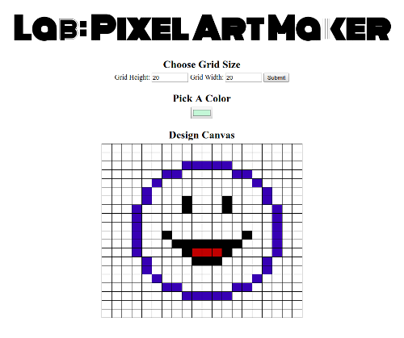

# Pixel Art Maker Project

Define the grid size, choose a color, and start painting.

## Live Version

Click [here](https://karoldavid.github.io/pixel-art-maker/) to see a live version.

## Getting Started

1. Clone or download the repository.
2. `cd` into the project directory.
3. Double click index.html to open the Pixel Art Maker in a browser
4. Switch branches to see the Vanilla JavaScript and the jQuery version

## Author

* **Karol Zyskowski**

Questions? Send an email to: k.zysk@zoho.com

## Contributing

This is a project of the Udacity Front-End Web Dev Nanodegree.Therefore, I will most likely not accept pull requests.

## License

This project is licensed under the MIT License - see the [LICENSE.md](LICENSE.md) file for details

## Acknowledgements

* https://www.udacity.com/course/front-end-web-developer-nanodegree--nd001
